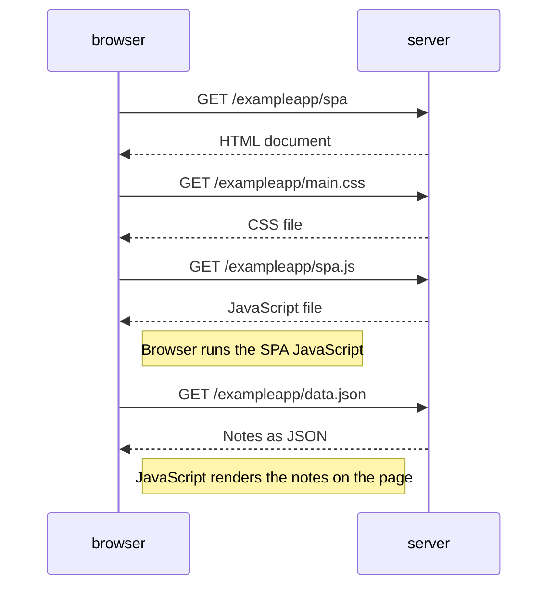

# Exercise 0.5 - Opening the SPA

```mermaid
sequenceDiagram
    participant browser
    participant server

    browser->>server: GET /exampleapp/spa
    server-->>browser: HTML document

    browser->>server: GET /exampleapp/main.css
    server-->>browser: CSS file

    browser->>server: GET /exampleapp/spa.js
    server-->>browser: JavaScript file

    Note right of browser: Browser runs the SPA JavaScript

    browser->>server: GET /exampleapp/data.json
    server-->>browser: Notes as JSON

    Note right of browser: JavaScript renders the notes on the page
```