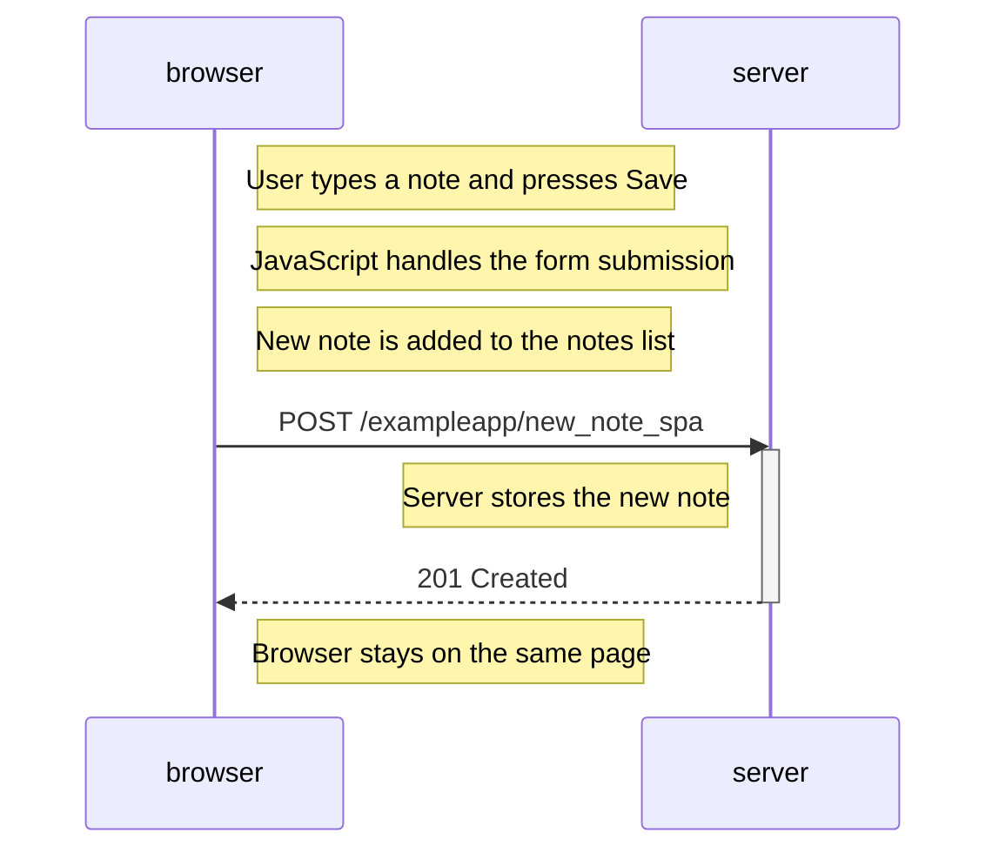

# Exercise 0.6 - Creating a Note in SPA

```mermaid
sequenceDiagram
    participant browser
    participant server

    Note right of browser: User types a note and presses Save

    Note right of browser: JavaScript handles the form submission

    Note right of browser: New note is added to the notes list

    browser->>server: POST /exampleapp/new_note_spa
    activate server

    Note left of server: Server stores the new note

    server-->>browser: 201 Created
    deactivate server

    Note right of browser: Browser stays on the same page
```